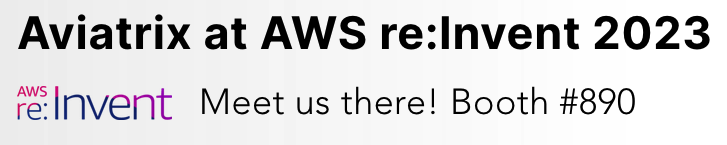
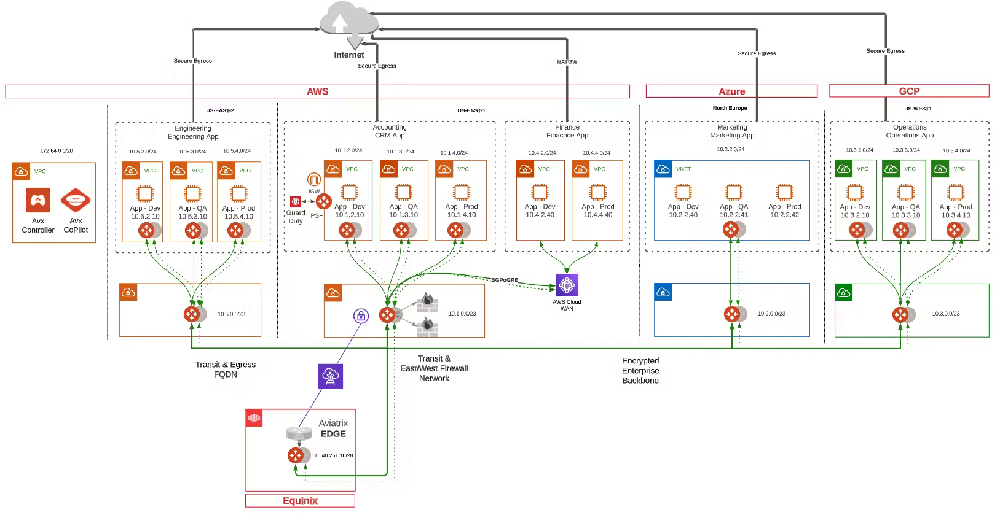
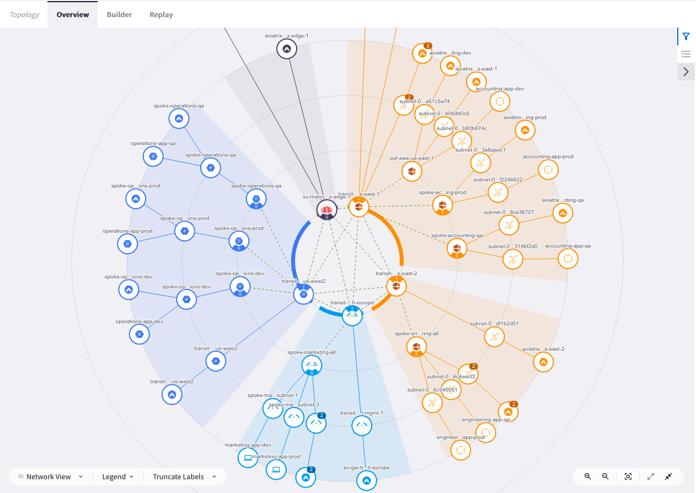

# aws-reinvent-2022



## Description

This terraform module is the basis for the demonstration infrastructure used by Aviatrix at 2022 AWS re:Invent. The module builds a full-mesh Airspace network across 4 CSPs with 3 attached application (dev, qa, prod) networks in each cloud (save for Azure where application segmentation is achieved with an Intra-VNet firewall, orchestrated by Aviatrix).

## Prerequisites

This module requires a deployed Aviatrix Controller with accounts onboarded for AWS, Azure, GCP, and OCI in any cloud.

## Infrastructure

  
_Fig. Network Topology_  

  
_Fig. Network Map_  

## Usage Example

```terraform
module "reinvent" {
  source               = "github.com/AviatrixSystems/aws-reinvent-2022"
  aws_account          = "onboarded aws account name"
  azure_account        = "onboarded azure account name"
  gcp_account          = "onboarded gcp account name"
  oci_account          = "onboarded oci account name"
  }
}

provider "aviatrix" {
  username      = "controller username"
  password      = "controller password"
  controller_ip = "controller ip or dns name"
}

terraform {
  required_providers {
    aviatrix = {
      source  = "aviatrixsystems/aviatrix"
      version = ">= 2.24.0"
    }
  }
  required_version = ">= 1.2.0"
}

```

## Variables

The following variables are required:
key | value
:--- | :---
aws_account | The label given to the `AWS` account credential in the Aviatrix Controller
azure_account | The label given to the `Azure` account credential in the Aviatrix Controller
gcp_account| The label given to the `GCP` account credential in the Aviatrix Controller
oci_account | The label given to the `OCI` account credential in the Aviatrix Controller

## Notes

The scope of this module is limited to the Airspace networks deployed and connected as well as Palo Alto firewall insertion. Items included in the demonstration infrastructure, but out of scope for this module include:

- Cloud application instances within the application networks.
- Edge connectivity with Equinix
- Distributed Firewalling configuration
- CostIQ configuration
- Egress FQDN configuration
