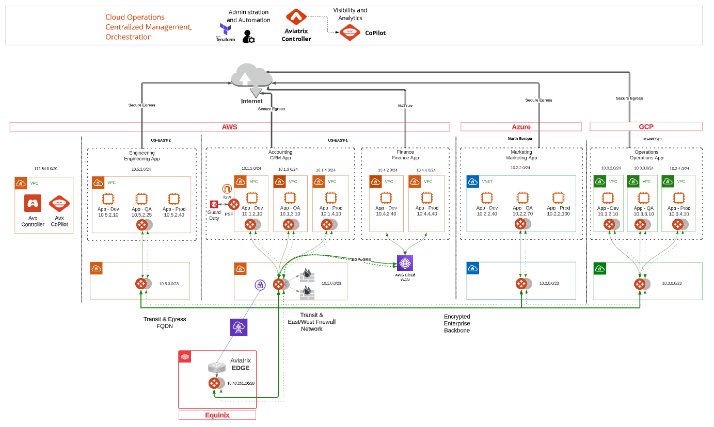

# aviatrix-aws-reinvent


[Aviatrix at re:Invent 2023](https://aviatrix.com/aviatrix-at-aws-reinvent-2023/)

## Description

This terraform module is the basis for the demonstration infrastructure used by Aviatrix at 2023 AWS re:Invent. The module builds a full-mesh backbone network across 3 CSPs with 3 attached application (dev, qa, prod) spoke networks in each cloud (save for Azure where application segmentation in a single VNET is achieved with NSG Orchestration via Aviatrix).

## Prerequisites

This module requires a deployed Aviatrix Controller with accounts onboarded for AWS, Azure, and GCP.

## Infrastructure

  
_Fig. Network Diagram_  

  
_Fig. Network Topology_  

## Usage Example

```terraform
module "reinvent" {
  source               = "github.com/AviatrixSystems/aviatrix-aws-reinvent"
  aws_account          = "onboarded aws account name"
  azure_account        = "onboarded azure account name"
  gcp_account          = "onboarded gcp account name"
  providers = {
    aws           = aws
    aws.us-east-2 = aws.us-east-2
  }
}

provider "aviatrix" {
  username      = "controller username"
  password      = "controller password"
  controller_ip = "controller ip or dns name"
}

provider "aws" {
  region  = "us-east-1"
}

provider "aws" {
  alias   = "us-east-2"
  region  = "us-east-2"
}

terraform {
  required_providers {
    aviatrix = {
      source  = "aviatrixsystems/aviatrix"
      version = ">= 3.1.0"
    }
  }
  required_version = ">= 1.5.0"
}

```

## Variables

The following variables are required:
| key           | value                                                                        |
| :------------ | :--------------------------------------------------------------------------- |
| aws_account   | The label given to the `AWS` account credential in the Aviatrix Controller   |
| azure_account | The label given to the `Azure` account credential in the Aviatrix Controller |
| gcp_account   | The label given to the `GCP` account credential in the Aviatrix Controller   |

## Notes

The scope of this module is limited to the networks deployed as well as Palo Alto firewall insertion. Items included in the demonstration infrastructure, but out of scope for this module include:

- Traffic generating instances within the application spoke networks.
- Edge connectivity with Equinix.
- CostIQ configuration.
